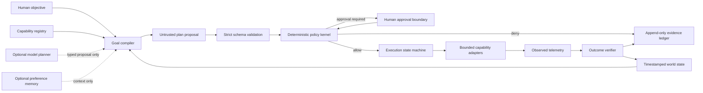

<h1 align="center">Handsoff</h1>

<p align="center"><strong>Autonomy for ordinary life.</strong></p>

<p align="center"><strong>A local-first, vendor-independent runtime for turning human goals into policy-checked actions and verified real-world outcomes.</strong></p>

<p align="center">
  
  
  
  
  
</p>

<p align="center"><em>Internal prototype description: Physical Codex</em></p>

> [!IMPORTANT]
> Handsoff is currently at **Milestone 1: contracts and deterministic tests**. Strict domain contracts, executable policy-result and transition invariants, a deterministic test clock, six reference scenario fixtures, and repository quality gates exist. The policy kernel, execution engine, simulator behavior, persistence, API, external-provider adapters, integrations, and user interface do not. This repository does not control real devices.

## The idea

Most consumer automation begins with commands:

> If this event occurs, send this instruction to that device.

Handsoff begins with an outcome:

> Prepare my environment for arrival in five minutes.

The system is designed to compile that objective into an inspectable typed plan, evaluate every proposed action with deterministic policy, execute only allowlisted capabilities, and verify the resulting world state from fresh telemetry. A successful API response is not treated as proof that a physical effect occurred.

The model can propose a plan. It can never grant itself authority to act.

## Why this architecture exists

| Conventional automation | Handsoff target architecture |
|---|---|
| Device commands and trigger chains | Goals with explicit acceptance conditions |
| Vendor-specific orchestration | Typed, replaceable capability adapters |
| API success treated as completion | Independent telemetry-based outcome verification |
| Implicit or scattered authority | Deterministic, versioned policy decisions |
| Best-effort handling of stale state | Timestamp, freshness, confidence, and contradiction checks |
| Partial failure hidden behind a success path | Explicit partial-success, failure, timeout, and compensation states |
| Cloud provider as the control plane | Local policy, execution state, and operational ledger |

Handsoff is not intended to replace Matter, Home Assistant, device firmware, or vendor APIs. It is a user-owned coordination and verification layer above bounded integrations.

## Contents

- [The idea](#the-idea)
- [Why this architecture exists](#why-this-architecture-exists)
- [System model](#system-model)
- [Safety invariants](#safety-invariants)
- [Canonical demonstration](#canonical-demonstration)
- [Current implementation status](#current-implementation-status)
- [Autonomy modes](#autonomy-modes)
- [Repository structure](#repository-structure)
- [Getting started](#getting-started)
- [Validation](#validation)
- [Dependency strategy](#dependency-strategy)
- [Roadmap](#roadmap)
- [Engineering documentation](#engineering-documentation)
- [Security and privacy](#security-and-privacy)
- [Engineering standard](#engineering-standard)
- [License and naming](#license-and-naming)

## System model

Handsoff uses a **modular monolith with hexagonal boundaries**. Domain logic remains independent of web frameworks, databases, model SDKs, device providers, and user-interface code. External systems attach through explicit ports and constrained adapters.



### Authority and evidence boundaries

| Component | May propose | May authorize | May execute | May verify |
|---|---:|---:|---:|---:|
| User | Yes | Through explicit approval | No direct runtime bypass | Defines acceptance conditions |
| Gemini planner adapter | Yes | No | No | No |
| Optional semantic memory | Context only | No | No | No |
| Deterministic policy kernel | No | Yes | No | No |
| Execution state machine | No | Enforces prior decision | Through bounded adapters | No |
| Outcome verifier | No | No | No | Yes, from explicit conditions and observations |

See [Architecture](docs/architecture.md) for the fixed architectural decisions, target bounded contexts, trust boundary, and structural constraints.

## Safety invariants

These are architectural requirements. Milestone 1 makes their data and transition boundaries executable as strict contracts; Milestone 2 must implement and prove the runtime behavior.

1. **No model-to-actuator path.** Model output is untrusted proposed data.
2. **Least authority.** Every adapter exposes typed, versioned, allowlisted capabilities.
3. **Fail closed.** Ambiguity, stale telemetry, invalid schemas, policy failure, or unavailable verification prevents actuation.
4. **State is time-bounded.** Observations require timestamps, freshness limits, source identity, and quality indicators.
5. **Acceptance is not verification.** An adapter accepting a command does not prove the intended effect occurred.
6. **Duplicate effects are bounded.** Commands require idempotency behavior and duplicate-action prevention.
7. **Autonomy mode is explicit.** Runtime mode is configured and recorded, never inferred from provider availability.
8. **R3 actions are prohibited.** Safety-critical, vehicle-motion, life-support, fire, gas, high-energy, and security-critical actions cannot execute in the prototype.
9. **Evidence precedes claims.** Plans, policy decisions, approvals, transitions, observations, and verification results require an inspectable trace.
10. **Providers remain replaceable.** Gemini, Supermemory, Home Assistant, and other vendors remain outside the deterministic critical path.

The full adversary model, required controls, residual risks, and risk classes are documented in the [Threat model](docs/threat-model.md).

## Canonical demonstration

The first target scenario is:

> **Prepare my environment for arrival in five minutes.**

The future deterministic simulator will coordinate vehicle trajectory, garage state, charger readiness, room conditioning, media readiness, energy constraints, and weather context.

The architecture is not demonstrated by a single happy path. The approved scenario suite must cover:

| Scenario | Required behavior |
|---|---|
| Nominal arrival | All permitted actions complete and every acceptance condition is verified |
| False proximity | No arrival actions execute when destination confidence is insufficient |
| Blocked garage | The garage action is withheld while obstruction telemetry is active |
| Demand response | Energy policy produces a bounded alternative rather than an unsafe override |
| Stale telemetry | Required stale observations block execution |
| Partial failure | The trace reports partial success, failure, or compensation—never false success |
| Malicious external text | Untrusted content cannot create an undeclared capability |

All six named reference fixtures are committed and schema-validated. Their expected results are test vectors for the future deterministic runtime, not observed runtime results.

## Current implementation status

| Area | Status | Evidence in this repository |
|---|---|---|
| Git and Python foundation | Implemented | Python 3.12 project metadata, package boundary, and locked dependency graph |
| Engineering documentation | Implemented | Product charter, architecture, privacy boundaries, threat model, verification plan, and ADRs |
| Repository quality gates | Implemented | Formatting, linting, strict typing, tests, coverage, audit, secret, docs, and repository checks |
| Strict domain contracts | Implemented | Goals, observations, capabilities, plans, policy results, approvals, transitions, events, verification, and scenarios |
| Policy and transition invariants | Implemented at contract layer | Contradictory policy results, R3 authorization, illegal state transitions, cycles, and undeclared references are rejected |
| Deterministic test clock | Implemented | UTC-only monotonic clock behind a clock port |
| Reference scenario fixtures | Implemented | Six self-contained simulation-only YAML fixtures with deterministic expected outcomes |
| Deterministic runtime and simulator | Not implemented | Specified for Milestone 2 |
| Gemini planner adapter | Not implemented | Dependency boundary reserved; implementation deferred to Milestone 3 |
| Operator interface | Not implemented | Thin local FastAPI/web boundary specified for Milestone 4 |
| Supermemory demonstration | Not implemented | Optional and outside the critical path; deferred to Milestone 5 |
| Home Assistant integration | Not implemented | Read-only shadow integration considered only after the simulator baseline |
| Real device actuation | Prohibited | No real actuation in the prototype |

The package version is `0.1.0` to identify the completed contract milestone. There is currently no application server, command-line interface, demo runner, or supported end-user workflow.

## Autonomy modes

| Mode | State source | Planning | Execution | Status |
|---|---|---|---|---|
| Simulation | Deterministic simulated state | Yes | Simulated actions only | Required prototype baseline |
| Shadow | Live read-only state | Yes | None | Architecture-ready; optional demonstration |
| Supervised | Live state | Yes | Only after explicit approval | Post-prototype |
| Live bounded | Live state | Yes | Allowlisted low-risk actions | Post-security review |

Simulation support itself is not implemented yet. This table defines the approved progression of authority.

## Repository structure

The current repository is intentionally smaller than the target runtime architecture:

```text
handsoff/
├── AGENTS.md                       # Repository engineering agreement
├── README.md                       # Project entry point
├── pyproject.toml                  # Python project and quality-tool configuration
├── uv.lock                         # Exact dependency resolution
├── .python-version                 # Python 3.12 baseline
├── .env.example                    # Empty configuration placeholders only
├── docs/
│   ├── product-charter.md
│   ├── architecture.md
│   ├── privacy-boundaries.md
│   ├── threat-model.md
│   ├── verification-plan.md
│   └── adr/
│       ├── 0001-modular-monolith.md
│       ├── 0002-model-is-not-controller.md
│       └── 0003-simulator-first.md
├── scripts/
│   ├── check_docs.py
│   ├── check_repository.py
│   ├── check_secrets.py
│   └── validate.py
├── src/handsoff/
│   ├── adapters/clock/
│   │   └── deterministic.py        # Explicitly advanced UTC test clock
│   ├── domain/
│   │   ├── capabilities.py
│   │   ├── events.py
│   │   ├── execution.py
│   │   ├── goals.py
│   │   ├── observations.py
│   │   ├── plans.py
│   │   ├── policies.py
│   │   └── scenarios.py
│   ├── ports/
│   │   └── clock.py
│   ├── __init__.py
│   └── py.typed
├── scenarios/
│   ├── blocked_garage.yaml
│   ├── demand_response.yaml
│   ├── false_proximity.yaml
│   ├── nominal_arrival.yaml
│   ├── partial_failure.yaml
│   └── stale_telemetry.yaml
└── tests/
    ├── contract/
    ├── fixtures/
    ├── property/
    ├── unit/
    └── test_foundation.py
```

Application services, device/model/persistence/memory adapters, API, simulator behavior, and web paths will be added only when their corresponding milestones are authorized. The complete target layout is maintained in [Architecture](docs/architecture.md).

## Getting started

### Prerequisites

- Git
- [`uv`](https://docs.astral.sh/uv/) 0.11 or later
- Python 3.12; `uv` can provision the interpreter if it is not already installed

### Clone and reproduce the environment

```bash
git clone https://github.com/Vedangalle/handsoff.git
cd handsoff
uv python install 3.12
uv sync --frozen
```

This installs the project and default development dependency group exactly from `uv.lock`.

To reproduce the environment used by the complete validation suite, including the optional Gemini planner dependency boundary:

```bash
uv sync --frozen --all-extras
```

No credential is required for Milestone 1. `.env.example` contains names and empty values only. Do not add real credentials to fixtures, prompts, logs, screenshots, tests, or version control.

> [!NOTE]
> There is no application to launch at Milestone 1. A successful installation and test run prove the contract surface and fixtures can be reproduced; they do not prove runtime behavior.

## Validation

Run the complete CI-equivalent local gate:

```bash
uv run --frozen --all-extras python scripts/validate.py
```

The aggregate command stops at the first failure and executes:

| Gate | Command | What it establishes |
|---|---|---|
| Format | `ruff format --check .` | Python formatting matches the repository configuration |
| Lint | `ruff check .` | Configured Ruff rules pass |
| Static typing | `mypy src scripts tests` | Strict Python 3.12 analysis passes |
| Tests | `coverage run -m pytest` | The current test suite passes under strict pytest settings |
| Coverage | `coverage report` | Package branch coverage meets the configured threshold |
| Lock consistency | `uv lock --check` | `pyproject.toml` and `uv.lock` agree |
| Dependency audit | `pip-audit --local --cache-dir .cache/pip-audit` | Installed dependencies have no reported known vulnerabilities |
| Secret scan | `python scripts/check_secrets.py` | Git-visible files contain no detected secret candidates |
| Documentation | `python scripts/check_docs.py` | Required documents, relative links, and Mermaid fence structure pass |
| Repository boundary | `python scripts/check_repository.py` | Milestone, branch, placeholder, ignore, Python, and license invariants hold |
| Whitespace | `git diff --check` | The tracked diff has no whitespace errors |

The detailed evidence contract, known limitations of documentation validation, and future test hierarchy are in the [Verification plan](docs/verification-plan.md).

## Dependency strategy

The deterministic core must remain installable and testable without Gemini, Supermemory, or Home Assistant.

### Declared runtime foundation

- `pydantic` — strict schemas at trust boundaries
- `fastapi` and `uvicorn` — future thin local API and process boundary
- `sqlalchemy` and `alembic` — future local SQLite persistence and explicit migrations
- `httpx` — external adapter transport and test client
- `pyyaml` — future human-readable deterministic scenario fixtures

### Optional integration boundary

- `google-genai` is isolated in the `planner-gemini` extra. Declaring the dependency does not implement or enable the adapter.
- No Supermemory or Home Assistant dependency has been selected.

### Explicit exclusions

The prototype core does not use LangChain, a general agent framework, Celery, Redis, Kafka, Kubernetes, a vector database, an embedded policy DSL, or a direct Matter implementation. Additional infrastructure must be justified by measured requirements, not architectural fashion.

## Roadmap

| Milestone | Scope | State |
|---|---|---|
| **M0 — Repository foundation** | Git, Python project, lockfile, documentation, ADRs, and local quality gates | **Complete** |
| **M1 — Contracts and deterministic tests** | Domain vocabulary, strict schemas, test clock, scenario schema, six fixtures, and fail-first invariant tests | **Complete** |
| **M2 — Deterministic runtime** | World model, capability registry, policy kernel, state machine, verifier, ledger, and simulator | Not started |
| **M3 — Gemini planner** | Minimized prompts, structured plan proposals, deterministic fallback, and model evaluation | Not started |
| **M4 — Operator interface** | World state, proposed plan, policy reasons, approval boundary, execution timeline, and replay | Not started |
| **M5 — Optional Supermemory demonstration** | Long-horizon preference context outside authority, execution, and verification | Not started |
| **M6 — Shadow integration** | Read-only Home Assistant discovery and events, if justified | Not started |

Milestone sequencing is intentional. Provider integrations do not precede the deterministic contracts and simulator.

## Engineering documentation

| Document | Purpose |
|---|---|
| [Product charter](docs/product-charter.md) | Mission, user, prototype wedge, principles, promise, and non-goals |
| [Architecture](docs/architecture.md) | Fixed decisions, data flow, trust boundary, bounded contexts, and target structure |
| [Privacy boundaries](docs/privacy-boundaries.md) | Data zones, credential handling, external-provider disclosure, and residual privacy risk |
| [Threat model](docs/threat-model.md) | Assets, adversaries, abuse paths, controls, risk classes, and residual risk |
| [Verification plan](docs/verification-plan.md) | Evidence standard, current gates, future test hierarchy, and prototype acceptance criteria |
| [ADR 0001](docs/adr/0001-modular-monolith.md) | Modular monolith with hexagonal boundaries |
| [ADR 0002](docs/adr/0002-model-is-not-controller.md) | Model planning without model authority |
| [ADR 0003](docs/adr/0003-simulator-first.md) | Deterministic simulation before live integration |
| [AGENTS.md](AGENTS.md) | Repository-specific engineering, review, security, and validation agreement |

Architecture decisions 1–10 were approved on 2026-07-13. Changes to those decisions require explicit review and a new or superseding ADR.

## Security and privacy

Handsoff may eventually process data that reveals location, occupancy, routine, energy use, media context, device state, and action history. “Local-first” means the trusted operational core remains local by default; it does **not** mean configured external-provider calls remain on-device.

- Credentials belong in ignored local environment files or OS credential interfaces, never source control or model context.
- External-provider inputs must be minimized and documented.
- Optional memory cannot grant authority, change policy, execute actions, or verify outcomes.
- Evidence exports require review and redaction before leaving the local boundary.
- No real household data is required for the deterministic demonstration.

Report suspected security issues privately to the repository owner rather than publishing credential material or exploit details in an issue. No claim of production security, regulatory compliance, formal verification, penetration testing, or hardware-in-the-loop validation is made.

## Engineering standard

Changes are expected to preserve architectural boundaries, document assumptions, distinguish observed evidence from planned behavior, and include verification proportional to risk. Before proposing a commit, run the aggregate validation suite and inspect the exact diff and Git status.

Repository-specific instructions are defined in [AGENTS.md](AGENTS.md).

## License and naming

No software license has been selected. The absence of a license means permission to use, copy, modify, or distribute this work should not be inferred. A `LICENSE` file and package license metadata will be added only after an explicit owner decision.

`Handsoff` is a hackathon working title, not a cleared commercial identity. Trademark, company-name, package-name, repository-name, social-handle, and domain clearance remain future work.

---

<p align="center">
  <strong>Handsoff</strong> · Autonomy for ordinary life.<br>
  Maintained by <a href="https://github.com/Vedangalle">Vedang Alle</a>
</p>
