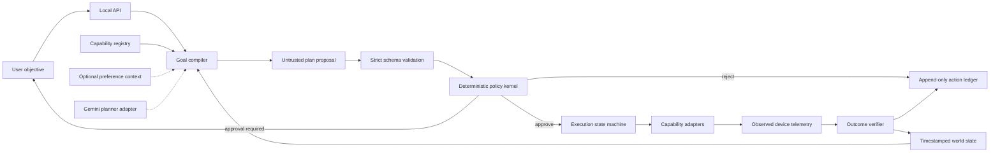
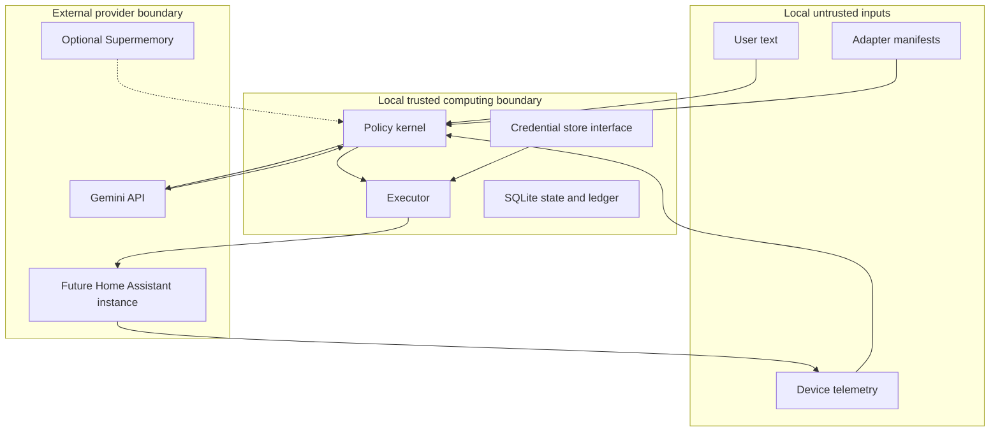

# Architecture

## Status and fixed decisions

Vedang Alle approved architecture decisions 1–10 on 2026-07-13:

1. Handsoff is a goal-to-verified-outcome runtime.
2. The prototype wedge is a coordinated arrival-home scenario.
3. The implementation is a Python modular monolith with hexagonal boundaries.
4. Python 3.12 and `uv` provide the reproducible runtime and lockfile baseline.
5. Local SQLite holds state and an append-only operational ledger.
6. Gemini may propose typed plans but cannot execute actions.
7. The deterministic simulator comes first; Home Assistant is read-only later.
8. Supermemory is optional and outside the critical execution path.
9. A thin local web interface uses FastAPI and contains no domain logic.
10. R3 actions are prohibited, with no real actuation in the prototype.

These decisions are constraints. Changes require a new approved architectural decision.

## Architectural style

The target is one deployable process with explicit hexagonal boundaries:

- domain logic imports no FastAPI, database, Gemini, Home Assistant, or Supermemory implementation;
- application services orchestrate domain operations through ports;
- adapters implement models, persistence, devices, time, and optional memory;
- one process owns the execution state machine during the prototype; and
- the user interface communicates through a typed local API.

This is a modular monolith, not a distributed system, general robotics platform, or live hardware controller.

## Control and data flow



No model output grants authority. An adapter success response proves command acceptance only; independent fresh telemetry must satisfy explicit acceptance conditions before an effect is verified.

## Trust boundary



“Local-first” does not mean all data stays local. Any provider call crosses the local trust boundary and must use minimized, documented input without credentials.

## Target bounded contexts

- **World model:** normalized, timestamped observations with source, freshness, quality, units, and correlation.
- **Capability registry:** typed, versioned, bounded contracts with risk, authorization, preconditions, evidence, timeouts, idempotency, compensation, and supported modes.
- **Goal compiler:** produces an untrusted `PlanProposal`; a deterministic fixture planner keeps the core provider-independent.
- **Policy kernel:** pure typed Python returns `deny`, `require_approval`, or `allow` with versioned reasons and considered inputs.
- **Execution state machine:** distinguishes planning, authorization, dispatch, adapter acceptance, observation, verification, failure, timeout, and compensation.
- **Outcome verifier:** evaluates explicit acceptance conditions against fresh post-action observations.
- **Operational ledger:** append-only events for inputs, decisions, transitions, outcomes, and failures without making the entire application event-sourced.
- **Adapter layer:** contains all provider, persistence, clock, memory, and device implementations.

## Autonomy modes

| Mode | Reads live state | Produces plan | Executes action | Prototype status |
|---|---:|---:|---:|---|
| Simulation | Simulated | Yes | Simulated | Required |
| Shadow | Yes | Yes | No | Architecture-ready; optional demo |
| Supervised | Yes | Yes | Only after approval | Post-prototype |
| Live bounded | Yes | Yes | Allowlisted low-risk actions | Post-security review |

Mode is explicit configuration included in every trace. It is never inferred from provider availability.

## Target repository structure

The approved end-state structure is incremental. Milestone 0 creates only documentation, package metadata, validation scripts, and a package boundary. Later paths are created when their milestones are authorized.

```text
handsoff/
├── AGENTS.md
├── README.md
├── pyproject.toml
├── uv.lock
├── .python-version
├── .env.example
├── .gitignore
├── docs/
│   ├── product-charter.md
│   ├── architecture.md
│   ├── threat-model.md
│   ├── verification-plan.md
│   ├── privacy-boundaries.md
│   └── adr/
├── src/handsoff/
│   ├── domain/
│   ├── application/
│   ├── ports/
│   ├── adapters/
│   ├── api/
│   └── config.py
├── web/
├── scenarios/
├── tests/
└── scripts/
```

The proposal included a `LICENSE` path. It is intentionally absent until Vedang selects a license. The target code subpackages, scenario fixtures, demo runner, and web directories are deferred because creating their behavior is outside Milestone 0.

## Dependency boundaries

Core declarations are `pydantic`, `fastapi`, `uvicorn`, `sqlalchemy`, `alembic`, `httpx`, and `pyyaml`. Their presence establishes reproducible interfaces but does not authorize runtime implementation. `google-genai` is an optional `planner-gemini` extra. No Supermemory or Home Assistant package is selected because those adapters are deferred and provider interfaces have not been evaluated.

No agent framework, message broker, container orchestrator, vector database, embedded policy DSL, or direct Matter implementation belongs in the prototype core.

## Structural constraints

- No `utils.py` dumping ground.
- No device-specific logic in domain or application packages.
- No model SDK objects outside the Gemini adapter.
- No database models passed through API routes.
- No UI logic in the executor.
- No runtime-generated data under version control.
- No credentials in fixtures, prompts, logs, screenshots, traces, or test output.

## Current implementation boundary

Milestone 0 implements none of the bounded contexts. `src/handsoff/__init__.py` provides package identity only. The architecture above is specified, not yet demonstrated.
