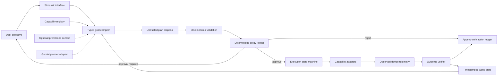
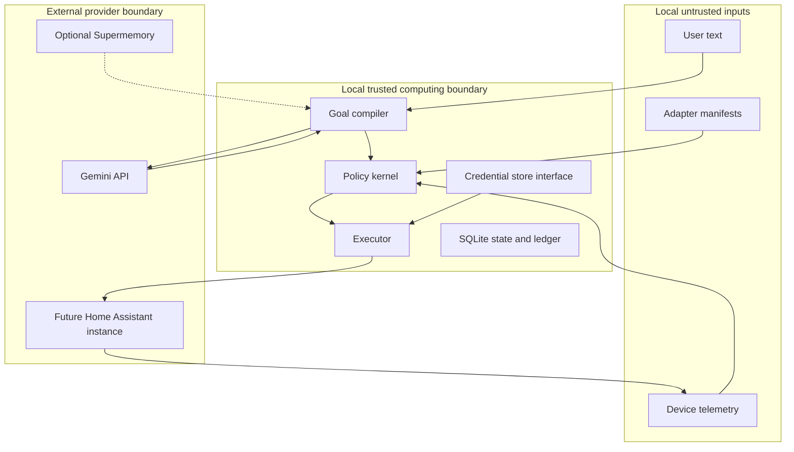

# Architecture

## Status and fixed decisions

Vedang Alle approved architecture decisions 1–10 on 2026-07-13:

1. Handsoff is a goal-to-verified-outcome runtime.
2. The prototype wedge is a coordinated arrival-home scenario.
3. The implementation is a Python modular monolith with hexagonal boundaries.
4. Python 3.12 and `uv` provide the reproducible runtime and lockfile baseline.
5. Local SQLite holds state and an append-only operational ledger.
6. Gemini may propose typed plans but cannot execute actions.
7. The deterministic simulator comes first; Home Assistant is read-only later.
8. Supermemory is optional and outside the critical execution path.
9. The original thin FastAPI interface decision is superseded for the hackathon by the Streamlit operator surface in [ADR 0004](adr/0004-streamlit-hackathon-interface.md); presentation still contains no domain logic.
10. R3 actions are prohibited, with no real actuation in the prototype.

These decisions are constraints. Changes require a new approved architectural decision.

## Architectural style

The target is one deployable process with explicit hexagonal boundaries:

- domain logic imports no Streamlit, database, Gemini, Home Assistant, or Supermemory implementation;
- application services orchestrate domain operations through ports;
- adapters implement models, persistence, devices, time, and optional memory;
- one process owns the execution state machine during the prototype; and
- the user interface communicates through a typed in-process application facade.

This is a modular monolith, not a distributed system, general robotics platform, or live hardware controller.

## Control and data flow



No model output grants authority. An adapter success response proves command acceptance only; independent fresh telemetry must satisfy explicit acceptance conditions before an effect is verified.

## Trust boundary



“Local-first” does not mean all data stays local. Any provider call crosses the local trust boundary and must use minimized, documented input without credentials.

## Target bounded contexts

- **World model:** normalized, timestamped observations with source, freshness, quality, units, and correlation.
- **Capability registry:** typed, versioned, bounded contracts with risk, authorization, preconditions, evidence, timeouts, idempotency, compensation, and supported modes.
- **Goal compiler:** produces an untrusted `PlanProposal`; a deterministic fixture planner keeps the core provider-independent.
- **Policy kernel:** pure typed Python returns `deny`, `require_approval`, or `allow` with versioned reasons and considered inputs.
- **Execution state machine:** distinguishes planning, authorization, dispatch, adapter acceptance, observation, verification, failure, timeout, and compensation.
- **Outcome verifier:** evaluates explicit acceptance conditions against fresh post-action observations.
- **Operational ledger:** append-only events for inputs, decisions, transitions, outcomes, and failures without making the entire application event-sourced.
- **Adapter layer:** contains all provider, persistence, clock, memory, and device implementations.

## Autonomy modes

| Mode | Reads live state | Produces plan | Executes action | Prototype status |
|---|---:|---:|---:|---|
| Simulation | Simulated | Yes | Simulated | Required |
| Shadow | Yes | Yes | No | Architecture-ready; optional demo |
| Supervised | Yes | Yes | Only after approval | Post-prototype |
| Live bounded | Yes | Yes | Allowlisted low-risk actions | Post-security review |

Mode is explicit configuration included in every trace. It is never inferred from provider availability.

## Target repository structure

Milestones 0–1 established the foundation and contracts, Milestone 2 implemented the deterministic runtime, Milestone 3 added contained planning and evaluation, and Milestone 4 completed the Streamlit and Supermemory hackathon surface.

```text
handsoff/
├── AGENTS.md
├── README.md
├── pyproject.toml
├── uv.lock
├── .python-version
├── .env.example
├── .gitignore
├── docs/
│   ├── product-charter.md
│   ├── architecture.md
│   ├── threat-model.md
│   ├── verification-plan.md
│   ├── privacy-boundaries.md
│   └── adr/
├── src/handsoff/
│   ├── domain/
│   │   ├── goals.py
│   │   ├── plans.py
│   │   ├── capabilities.py
│   │   ├── observations.py
│   │   ├── policies.py
│   │   ├── execution.py
│   │   ├── events.py
│   │   ├── scenarios.py
│   │   └── planning.py
│   ├── application/
│   ├── ports/
│   ├── adapters/
│   │   ├── planner/
│   │   ├── devices/simulator/
│   │   ├── persistence/
│   │   ├── memory/
│   │   └── clock/
│   └── presentation/              # Typed UI facade, ecosystem projection, and session state
├── streamlit_app.py               # Streamlit entrypoint
├── requirements.txt               # Community Cloud project extras
├── .streamlit/config.toml          # Non-secret deployment configuration
├── scenarios/
├── tests/
└── scripts/
```

The proposal included a `LICENSE` path. It is intentionally absent until Vedang selects a license. The completed hackathon application introduces no license metadata.

## Dependency boundaries

The deterministic runtime uses `pydantic`, `sqlalchemy`, `alembic`, `httpx`, and `pyyaml`. `google-genai` is isolated in the optional `planner-gemini` extra and Streamlit 1.59.2 is pinned in the `app` extra. The Supermemory adapter uses the existing HTTPX transport boundary rather than introducing its SDK into the core. FastAPI was removed after ADR 0004 eliminated the unused hackathon API process; Uvicorn may appear only as a transitive Streamlit dependency.

No agent framework, message broker, container orchestrator, vector database, embedded policy DSL, or direct Matter implementation belongs in the prototype core.

## Structural constraints

- No `utils.py` dumping ground.
- No device-specific logic in domain or application packages.
- No model SDK objects outside the Gemini adapter.
- No database models passed into presentation code.
- No UI logic in the executor.
- No runtime-generated data under version control.
- No credentials in fixtures, prompts, logs, screenshots, traces, or test output.

## Current implementation boundary

Milestone 4 completes the hackathon application:

- strict immutable contracts and provider-independent ports;
- normalized world state, capability registry, deterministic condition and policy evaluation, approval binding, execution state machine, independent verifier, duplicate suppression, bounded retries, and append-only in-memory/SQLite ledgers;
- a deterministic fixture planner and scripted simulator that reproduce all six reference scenarios without credentials or network access;
- a Gemini adapter using minimized JSON context and Pydantic structured output, with no tools or actuator access;
- deterministic fallback and model-evaluation records for schema validity, hallucinated capabilities, invalid parameters, missing preconditions, policy result, latency, and token usage;
- a context-only memory port plus no-op adapter so the core remains complete without Supermemory;
- fixed-scope read-only Supermemory hybrid search with bounded normalized output and empty-context fallback;
- per-browser Streamlit session state over a typed facade, with all six fixtures and every evidence layer visible; and
- an interactive whole-home projection derived only from committed scenario contracts and typed runtime evidence, with no dispatch or authorization surface; and
- an evidence-first judge projection that executes independent deterministic and contextual traces and compares semantic proposals without entering the authority path.

No Home Assistant integration, shadow-state ingestion, live device actuation, public memory writes, or real household data exists. Any such work is post-hackathon and requires a separately approved architecture and security review. The completed presentation and optional read-only memory design are documented in [the deployment guide](streamlit-deployment.md).
