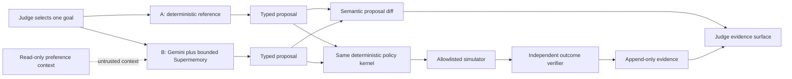
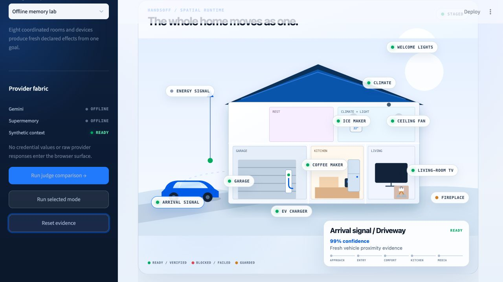
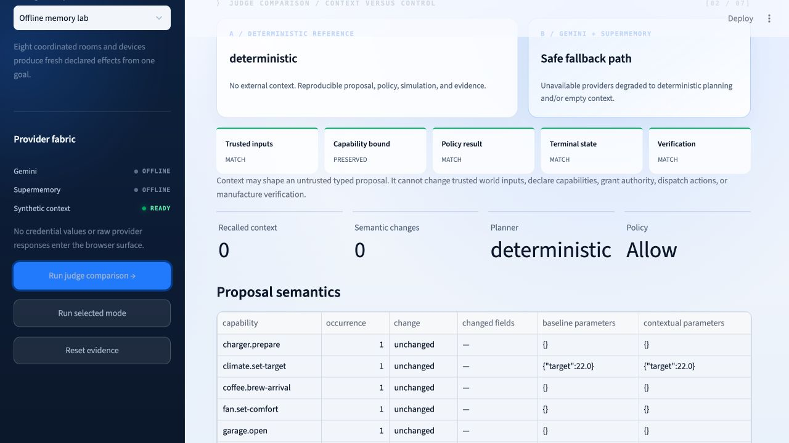

# Hackathon Judge Guide

## Deliverable

The primary deliverable is the running Handsoff Streamlit application. **Judge comparison** is a product feature, not a documentation mockup: one click executes a deterministic reference trace and a separate Gemini-plus-Supermemory trace, then compares the two from typed runtime evidence.

This guide is the supporting submission package. It contains the demonstration sequence, architecture graphic, submission copy, screenshot plan, live-provider acceptance procedure, and claims boundary.

## What Judge comparison proves

The comparison includes:

- bounded Supermemory records supplied to the planner when retrieval returns context;
- action semantics changed by the contextual proposal, excluding generated IDs and timestamps;
- identical or changed policy and outcome results, reported rather than assumed;
- the trusted-input fingerprint for the goal, observations, and declared capabilities;
- confirmation that every contextual capability remains in the committed allowlist; and
- complete policy, execution, verification, and ledger evidence for the contextual run.

When a provider is missing or fails, the application labels the path **Safe fallback path** and reports no semantic difference unless one was actually observed. It never presents fallback output as live model behavior.

## Judge architecture



Gemini receives no tool or capability-adapter object. Supermemory is fixed-scope and read-only. The comparison layer is a presentation projection over two complete runs; it does not authorize, execute, or verify anything.

## Ninety-second demonstration

| Time | Operator action | Narration |
|---:|---|---|
| 0–10 s | Open the app on the staged whole-home view. | “Handsoff turns one human outcome into coordinated, policy-bounded, verifiable behavior across the home.” |
| 10–22 s | Select **Whole-home evening arrival**. Point to the provider fabric and simulation boundary. | “Gemini may propose and Supermemory may supply preference context. Neither can grant authority, and this build controls no real device.” |
| 22–35 s | Click **Run judge comparison** once. | “The app now runs two isolated traces: a deterministic reference and a Gemini-plus-Supermemory path.” |
| 35–52 s | Let the house sequence run. Select the television, coffee maker, and fireplace. | “One goal coordinates entry, climate, lighting, media, ice, charging, and guarded coffee. The fireplace remains R3-locked and is never a capability.” |
| 52–68 s | Scroll to **Judge comparison**. Show recalled context, semantic changes, and five proof tiles. | “We compare behavior, not generated IDs. Context can shape a proposal; trusted inputs, capability bounds, policy authority, and verification remain explicit.” |
| 68–82 s | Open **Policy**, then **Verification** or **Evidence**. | “A model response is not execution, and adapter acceptance is not success. Fresh observations must satisfy the goal’s acceptance conditions.” |
| 82–90 s | Return to the outcome card. | “Handsoff is a vendor-independent control plane for goals whose authority stays deterministic and whose outcomes are proved.” |

If the live providers are unavailable, use **Offline memory lab** and state that it uses committed synthetic context. Do not describe it as a live Supermemory call.

## Submission copy

### Title

**Handsoff — verified autonomy for ordinary life**

### One sentence

Handsoff compiles one human goal into coordinated smart-environment actions, checks every proposal with deterministic policy, and verifies the resulting world state from evidence.

### Short description

Today’s smart environments expose separate apps and brittle trigger chains. Handsoff presents one coordinated system: a user states an outcome, optional Gemini planning and bounded Supermemory context shape a typed proposal, deterministic policy decides what is allowed, an execution state machine dispatches only declared capabilities, and fresh observations verify what actually happened. The hackathon build is a simulation with six reproducible scenarios and no real-device actuation.

### How sponsor technology is used

- **Gemini:** produces a Pydantic-constrained plan proposal from minimized goal, observation, capability, and preference context. It receives no tools and has no authorization or execution path.
- **Supermemory:** provides at most five fixed-scope, normalized, read-only preference records to the planner. Retrieved text is untrusted and cannot add a capability, change policy, approve an action, dispatch it, or verify an outcome.

### Technical differentiators

- goal and acceptance-condition interface rather than device commands;
- model proposal separated from deterministic authority;
- adapter acceptance separated from physical-effect verification;
- evidence-driven whole-home projection rather than a decorative dashboard;
- explicit stale-state, obstruction, partial-failure, and prohibited-capability scenarios; and
- complete credential-free fallback with honest provider provenance.

## Screenshot set

Use these two repository screenshots in the project submission:

1. `docs/assets/whole-home-staged.png` — coordinated spatial system and visible safety boundary before execution.
2. `docs/assets/judge-comparison-offline.png` — one-click comparison proving truthful provider fallback, semantic diff behavior, and invariant evidence without credentials.





For a live-provider submission screenshot, capture the same comparison only after the live acceptance procedure below reports **Live provider path**. Review the image before upload; it must contain no browser developer tools, provider dashboards, secret storage, credential values, raw prompts, or raw responses.

## User-only provider configuration

Real credentials never enter repository commands, source, tests, logs, screenshots, or commits. In VS Code, create the ignored file `.streamlit/secrets.toml` and paste the values you intend to use:

```toml
GOOGLE_API_KEY = ""
SUPERMEMORY_API_KEY = ""
HANDSOFF_MEMORY_SCOPE = "handsoff-public-demo-v1"
```

Paste each provider value exactly between its corresponding empty quotes. The file is already ignored. Do not change `.env.example`; it must remain placeholder-only. Because credential values were previously shared in chat, rotate them before any public deployment even if the current values still work.

For Streamlit Community Cloud, enter the same three names in **Advanced settings → Secrets**. Do not upload `.streamlit/secrets.toml`.

## Live-provider acceptance

This check is intentionally user-executed because repository validation never reads real credentials.

1. Configure the ignored local secrets file in VS Code.
2. Ensure the fixed Supermemory scope contains only synthetic demo preference records. One useful record is the fictional media preference “At evening arrival, resume Orbit Seven.” Do not use real household, location, or occupancy data.
3. Start the application with `uv run --frozen --all-extras streamlit run streamlit_app.py`.
4. Confirm the sidebar reports Gemini **Ready** and Supermemory **Read only**. This proves configuration presence only.
5. Select **Whole-home evening arrival** and click **Run judge comparison**.
6. Confirm the comparison reports **Live provider path**, identifies Gemini as the contextual planner, and shows the number of recalled records.
7. Inspect semantic changes. A zero-change result is valid evidence that the observed model response did not change behavior; rerunning must not be described as guaranteed to create a difference.
8. Confirm trusted inputs match, all contextual capabilities are declared, and policy, terminal state, and verification tiles report their observed relationship.
9. Open Policy, Verification, Evidence, and Memory. Confirm no credential value, raw provider response, or real household data appears.
10. Remove or rotate public-demo credentials after judging according to the provider account policy.

## Claims boundary

Observed automated evidence supports deterministic simulation correctness, schema and authority containment, fallback behavior, session isolation, and UI trace completeness. It does not establish real-device safety, provider availability, model quality beyond an observed run, independent sensor integrity, formal verification, penetration-test results, regulatory compliance, or production multi-tenancy.
