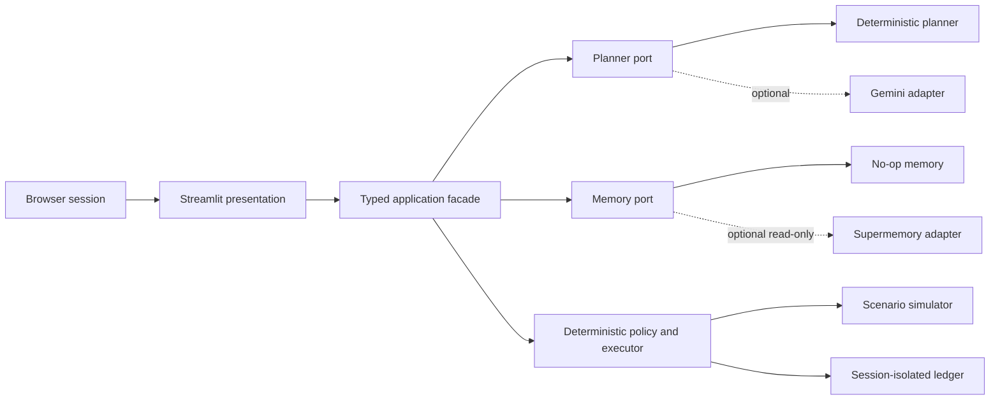

# Streamlit and Supermemory Deployment Plan

## Status

This is the approved Milestone 4 deployment design, not a claim that a Streamlit application already exists. Milestone 3 supplies the deterministic runtime, planner boundary, no-op memory adapter, and context-only memory port. Milestone 4 will add the presentation layer and Supermemory retrieval adapter.

## Deployment shape



Streamlit is a presentation adapter. It does not import provider SDK objects into domain code, evaluate policy, dispatch capabilities, or decide whether an outcome verified.

## Supported demonstration modes

| Mode | Gemini | Supermemory | Required credentials | Purpose |
|---|---:|---:|---|---|
| Deterministic baseline | Off | Off | None | Reproducible reference and fallback |
| Model planner | On | Off | `GOOGLE_API_KEY` | Compare Gemini proposals with the same policy/runtime |
| Context comparison | On or off | On | `SUPERMEMORY_API_KEY` and optionally `GOOGLE_API_KEY` | Show how bounded preference context changes a proposal, never authority |

The interface must make the active mode and every external-provider boundary visible. Provider failure falls back to deterministic planning or no memory; it never weakens policy.

## Supermemory retrieval contract

Milestone 4 will implement `MemoryProvider.retrieve()` using Supermemory semantic search:

- query: the current synthetic goal objective;
- container: a server-configured demo-only scope, never a browser-supplied tag;
- search mode: hybrid;
- result limit: five;
- output: source ID, bounded text, and relevance only;
- writes: disabled in the public hackathon deployment; and
- destination: `PlannerRequest.preference_context` only.

Retrieved content is normalized, truncated to 500 characters per item, explicitly labeled untrusted, and excluded from policy inputs, approvals, execution, verification, and authoritative ledger state. Supermemory's current API documents hybrid search with `containerTag` scoping and a bounded result limit in its [official search reference](https://supermemory.ai/docs/search).

## Public-demo isolation

Streamlit reruns application code and may serve multiple users from one process. Milestone 4 must therefore:

1. create runtime state per browser session;
2. avoid process-global mutable worlds, approvals, or ledgers;
3. use only committed synthetic scenarios;
4. use a fixed read-only Supermemory demo scope;
5. prevent browser-controlled provider endpoints, models, or container tags;
6. never cache credentials, raw prompts, provider responses, or memory results as shared data; and
7. provide a one-click reset that reconstructs the deterministic session.

The public deployment is an engineering demonstration, not a multi-tenant service or durable system of record.

## Secrets

Local development may use an ignored `.streamlit/secrets.toml`. Streamlit Community Cloud secrets belong in the deployment's Advanced settings and must not be committed. This follows Streamlit's [official secrets guidance](https://docs.streamlit.io/deploy/streamlit-community-cloud/deploy-your-app/secrets-management).

Placeholder shape only:

```toml
GOOGLE_API_KEY = ""
SUPERMEMORY_API_KEY = ""
HANDSOFF_MEMORY_SCOPE = "handsoff-public-demo-v1"
```

The application will read values only inside the configuration/presentation boundary, pass credentials directly to adapter constructors, and never display or log them.

## Community Cloud packaging

Milestone 4 will add:

- `streamlit_app.py` as the repository entrypoint;
- a pinned Streamlit optional dependency;
- a generated, reviewable `requirements.txt` because Community Cloud recommends a pip requirements file at the repository root or beside the entrypoint;
- `.streamlit/config.toml` containing non-secret visual/server configuration; and
- tests that import and smoke-test the application with providers disabled.

Deployment selects `main`, `streamlit_app.py`, and Python 3.12. Provider values are entered only in Advanced settings. Streamlit documents the [dependency-file requirement](https://docs.streamlit.io/deploy/streamlit-community-cloud/deploy-your-app/app-dependencies) and [Python/secrets deployment controls](https://docs.streamlit.io/deploy/streamlit-community-cloud/deploy-your-app/deploy).

## Milestone 4 acceptance

- All six scenarios are selectable and replayable.
- World state, proposal, policy reasons, approval boundary, action transitions, verification evidence, and ledger sequence are visible.
- Deterministic mode runs with no secrets and no network.
- Gemini invalid output or unavailability visibly falls back without side effects.
- Supermemory on/off comparison uses the same goal, capabilities, policy, and simulator.
- A malicious memory string cannot introduce an undeclared capability or affect authority.
- Session reset is deterministic.
- No credential or real household data appears in source, logs, screenshots, traces, or provider prompts.
