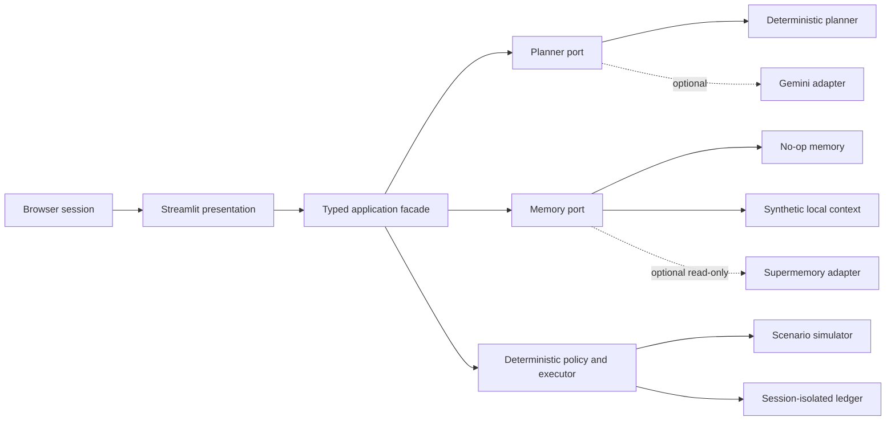

# Streamlit and Supermemory Deployment

## Status

Milestone 4 is implemented. `streamlit_app.py` is the public entrypoint; `handsoff.presentation` owns server configuration, the typed facade, and browser-session state; and the Supermemory adapter provides optional bounded read-only context. No presentation or provider component can authorize or dispatch an action.

## Deployment shape



Streamlit is a presentation adapter. It does not import provider SDK objects into domain code, evaluate policy, dispatch capabilities, or decide whether an outcome verified.

## Supported demonstration modes

| Mode | Gemini | Supermemory | Required credentials | Purpose |
|---|---:|---:|---|---|
| Deterministic baseline | Off | Off | None | Reproducible reference and fallback |
| Offline memory lab | Off | Synthetic local records | None | Complete no-key context and trust-boundary demonstration |
| Model planner | On | Off | `GOOGLE_API_KEY` | Compare Gemini proposals with the same policy/runtime |
| Context comparison | On or off | On | `SUPERMEMORY_API_KEY` and optionally `GOOGLE_API_KEY` | Show how bounded preference context changes a proposal, never authority |

The interface makes the active mode and every external-provider boundary visible. Synthetic records are committed fixtures labeled `OFFLINE / SYNTHETIC`; they never imply a live provider call. Provider failure falls back to deterministic planning or no memory; it never weakens policy.

## Judge comparison

**Run judge comparison** executes the selected scenario twice with fresh worlds, ledgers, planners, and memory adapters. Trace A uses the deterministic baseline. Trace B uses Gemini plus fixed-scope Supermemory with the existing fallback boundaries. The UI compares action meaning after excluding generated plan IDs, action IDs, idempotency keys, and timestamps.

The comparison reports provider provenance, recalled context, changed action fields, trusted-input fingerprint equality, declared-capability containment, policy-decision equality, terminal-state equality, and verification-result equality. A changed policy or outcome is rendered as observed evidence; the presentation never assumes that context must preserve or alter it. The contextual trace remains fully inspectable in the existing evidence tabs.

## Credential-free demonstration

The default public experience is the offline memory lab. It returns four bounded, deterministic preference records through `SyntheticMemoryProvider`, then executes the same planner, policy, simulator, verifier, and ledger used by every other mode. It is intended for local judging, screenshots, and deployments where provider credentials are unavailable.

Synthetic context can influence only `PlannerRequest.preference_context`. The deterministic planner intentionally ignores preference context, so the offline lab demonstrates retrieval and containment rather than claiming model personalization. A live proposal comparison requires an explicitly configured Gemini planner. This distinction is rendered in the interface.

## Supermemory retrieval contract

`SupermemoryMemoryProvider` implements `MemoryProvider.retrieve()` using Supermemory semantic search:

- query: the current synthetic goal objective;
- container: a server-configured demo-only scope, never a browser-supplied tag;
- search mode: hybrid;
- result limit: five;
- output: source ID, bounded text, and relevance only;
- writes: disabled in the public hackathon deployment; and
- destination: `PlannerRequest.preference_context` only.

Retrieved content is normalized, truncated to 500 characters per item, explicitly labeled untrusted, and excluded from policy inputs, approvals, execution, verification, and authoritative ledger state. Supermemory's current API documents hybrid search with `containerTag` scoping and a bounded result limit in its [official search reference](https://supermemory.ai/docs/api-reference/recall-search/search-memory-entries).

## Public-demo isolation

Streamlit reruns application code and may serve multiple users from one process. The implementation therefore:

1. create runtime state per browser session;
2. avoid process-global mutable worlds, approvals, or ledgers;
3. use only committed synthetic scenarios;
4. use a fixed read-only Supermemory demo scope;
5. prevent browser-controlled provider endpoints, models, or container tags;
6. never cache credentials, raw prompts, provider responses, or memory results as shared data; and
7. provide a one-click reset that reconstructs the deterministic session.

The public deployment is an engineering demonstration, not a multi-tenant service or durable system of record.

## Secrets

Local development may use an ignored `.streamlit/secrets.toml`. Streamlit Community Cloud secrets belong in the deployment's Advanced settings and must not be committed. This follows Streamlit's [official secrets guidance](https://docs.streamlit.io/deploy/streamlit-community-cloud/deploy-your-app/secrets-management).

Placeholder shape only:

```toml
GOOGLE_API_KEY = ""
SUPERMEMORY_API_KEY = ""
HANDSOFF_MEMORY_SCOPE = "handsoff-public-demo-v1"
```

The application will read values only inside the configuration/presentation boundary, pass credentials directly to adapter constructors, and never display or log them.

## Community Cloud packaging

Milestone 4 includes:

- `streamlit_app.py` as the repository entrypoint;
- a Streamlit 1.59.2 pin in the `app` optional dependency;
- a reviewable `requirements.txt` that installs the project extras and repeats the locked
  Streamlit 1.59.2 and Google Gen AI 1.75.0 pins so Community Cloud cannot omit them;
- `.streamlit/config.toml` containing non-secret visual/server configuration; and
- tests that import and smoke-test the application with providers disabled.

Deployment selects `main`, `streamlit_app.py`, and Python 3.12. Provider values are entered only in Advanced settings. Streamlit documents the [dependency-file requirement](https://docs.streamlit.io/deploy/streamlit-community-cloud/deploy-your-app/app-dependencies) and [Python/secrets deployment controls](https://docs.streamlit.io/deploy/streamlit-community-cloud/deploy-your-app/deploy).

## Milestone 4 acceptance evidence

- All six scenarios are selectable and replayable.
- The cutaway-home component projects device states from typed scenario and runtime evidence and has no authorization or dispatch path.
- The nominal goal verifies eight coordinated effects across the garage, charger, climate, coffee, fan, ice, lighting, and television.
- Verified effects are presented in an approach, entry, comfort, kitchen, and media sequence; animation never changes runtime state and honors reduced-motion preferences.
- Green, red, and amber device signals distinguish ready or verified, blocked or failed, and prohibited states; the fireplace remains visibly `R3 locked`.
- World state, proposal, policy reasons, approval boundary, action transitions, verification evidence, and ledger sequence are visible.
- Deterministic and offline-memory modes run with no secrets and no network.
- Gemini invalid output or unavailability visibly falls back without side effects.
- Supermemory on/off comparison uses the same goal, capabilities, policy, and simulator.
- A malicious memory string cannot introduce an undeclared capability or affect authority.
- Session reset is deterministic.
- No credential or real household data appears in source, logs, screenshots, traces, or provider prompts.

The automated suite exercises all six scenario selections, provider-disabled startup, Gemini fallback, fixed scope and result limits, malformed Supermemory responses, malicious memory content, deterministic reset/replay, independent session objects, visible evidence surfaces, fan-anchor and reduced-motion regression guards, and native Streamlit interaction through `streamlit.testing.v1.AppTest`. Live provider calls are intentionally excluded from repository validation because validation never reads real credentials.

## Local operation

```bash
uv sync --frozen --all-extras
uv run --frozen --all-extras streamlit run streamlit_app.py
```

The default offline memory lab and deterministic baseline are complete without `.streamlit/secrets.toml`. For optional live providers, create that ignored file locally using the empty names in `.env.example`, or configure those names in Streamlit Community Cloud Advanced settings. Use newly issued credentials only. Values are passed directly to adapter constructors and never rendered.

## Deployment procedure

1. Select repository `Vedangalle/handsoff`, branch `main`, and entrypoint `streamlit_app.py`.
2. Select Python 3.12.
3. Deploy deterministic mode without secrets first and run every reference scenario.
4. Add optional provider values only in Advanced settings.
5. Run Judge comparison without provider values and verify it reports **Safe fallback path** with no fabricated semantic change.
6. Add optional provider values only through Advanced settings, then follow the user-only [live-provider acceptance procedure](hackathon-judge-guide.md#live-provider-acceptance).
7. Verify Gemini failure shows deterministic fallback and Supermemory failure shows empty-context fallback.
8. Confirm no provider value, raw prompt, or raw response appears in UI output or logs.

Gemini SDK import or client-construction failure is contained at provider bootstrap and visibly
degrades to deterministic planning. It cannot terminate the Streamlit application.

Community Cloud is a public demonstration host, not a durable system of record. Every run reconstructs an in-memory simulator and ledger; browser sessions retain only their own last typed result.
